# Meu Portfólio de Projetos Figma
Meus projetos UI/UX do Figma

## Projetos 
## Clique no nome do projeto para ver no Figma

## [Projeto 1 - Landing Page de Venda de Casas](https://www.figma.com/design/9FE36vv39loTbSUk2bSWLH/AtividadePrototipo1?node-id=0-1&t=ysVUSanRFxhDrD43-1)
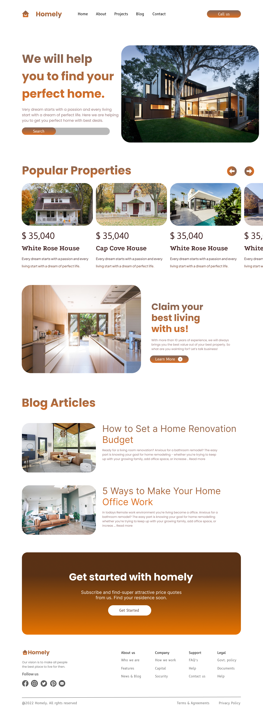

## [Projeto 2 - Landing Page de Viagens](https://www.figma.com/design/62Z6zxJUUau89wFsXSHaxL/AtividadePrototipacao2?t=ysVUSanRFxhDrD43-1)
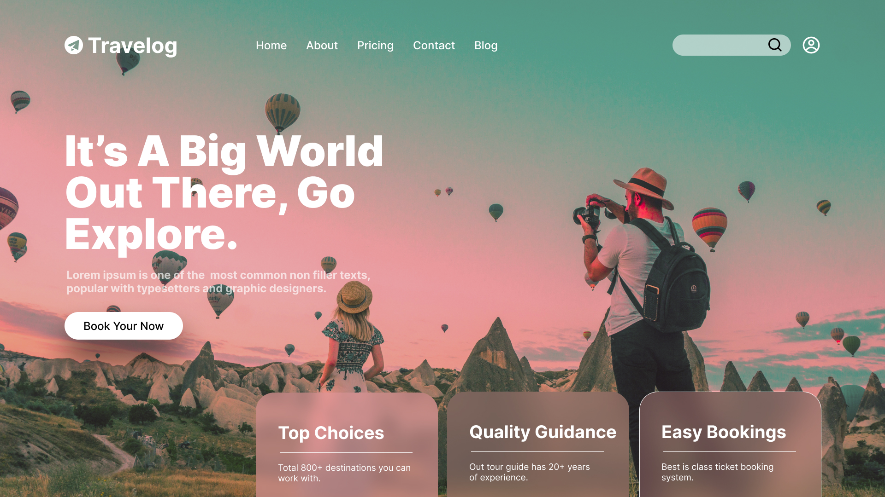

## [Projeto 3 - App Mobile de Venda de Alimentos](https://www.figma.com/design/WXKSDjki4U1tWt7BRrLgKD/AtividadePrototipo3?t=ysVUSanRFxhDrD43-1)

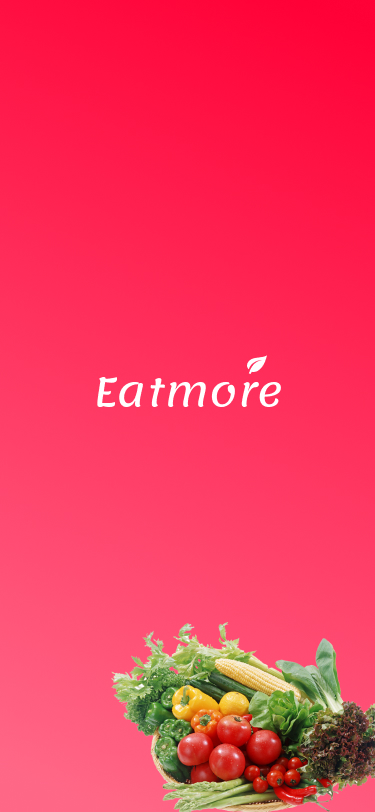
 &nbsp; 
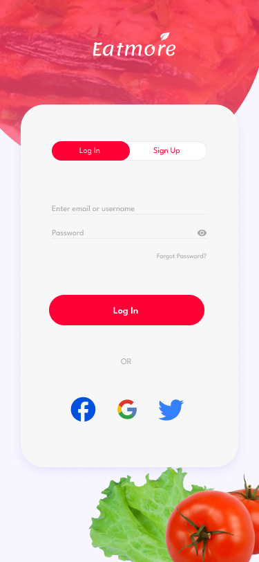
 &nbsp; 
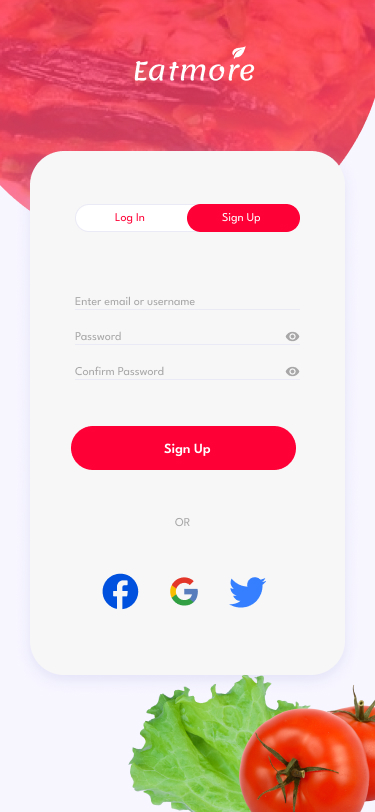
 &nbsp; 
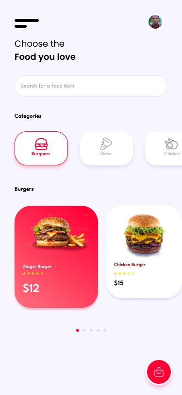

## [Projeto 4 - App Mobile de Fast Food](https://www.figma.com/design/PS5u80JIjEzh8KeWrCHHNc/AtividadePrototipo4?t=ysVUSanRFxhDrD43-1)

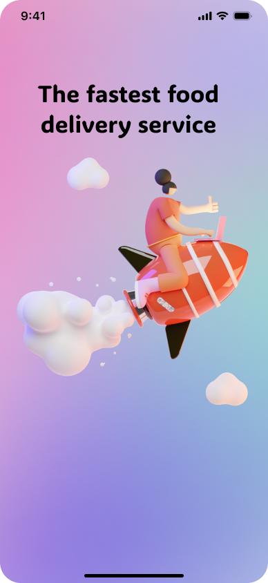
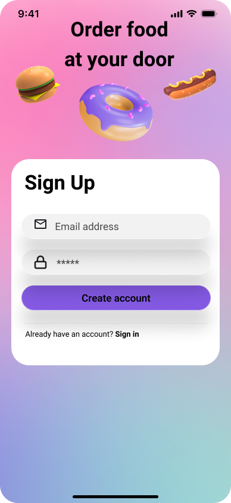
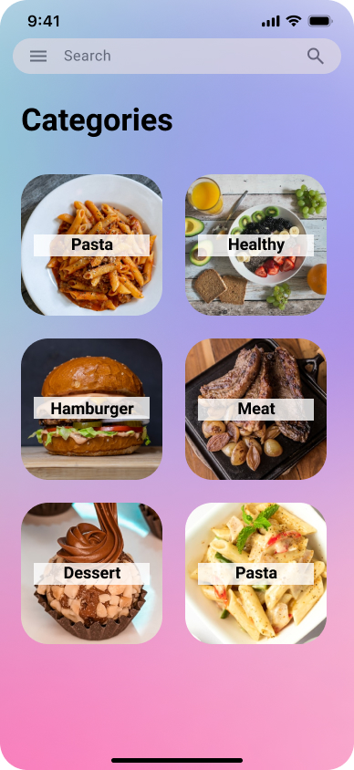

## [Projeto 5 - Plataforma de Ensino](https://www.figma.com/design/Lxhq3VVXgV8wHJGPCUd8G8/AtividadePrototipo5?t=wZGzEPuWuwmpAQjm-1)
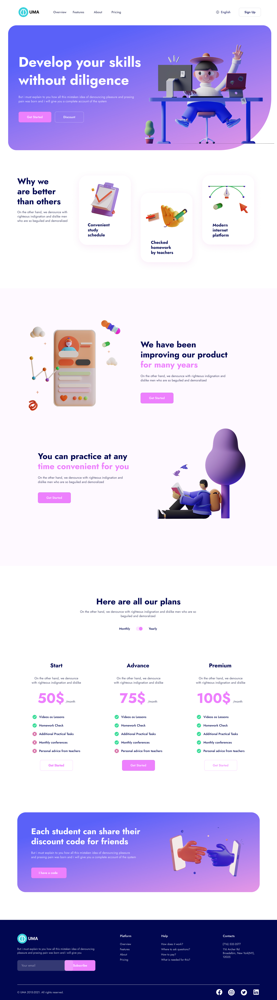

## [Projeto 6 - Website de um Restaurante](https://www.figma.com/design/FyJiT0Trr06RNqOxjqnORt/AtividadePrototipacao6?node-id=0-1&t=wZGzEPuWuwmpAQjm-1)

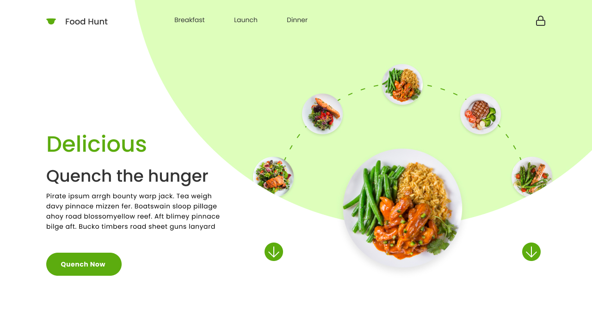
 &nbsp; 
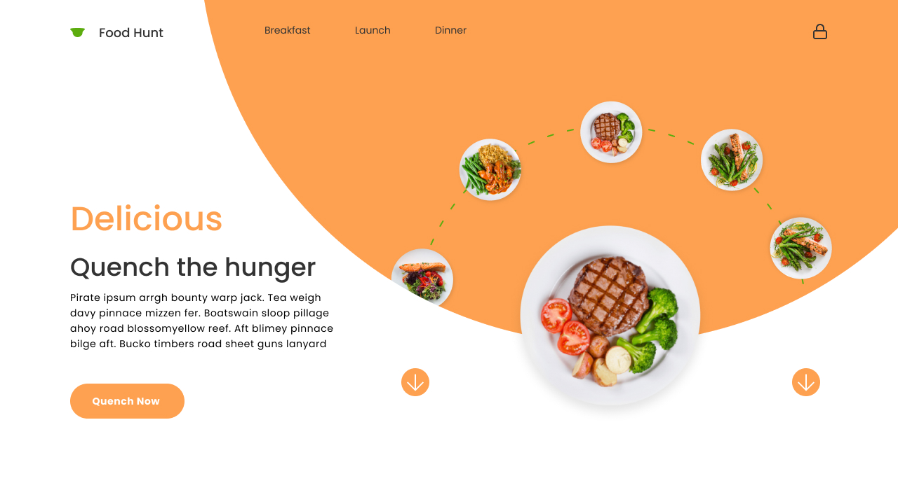

## [Projeto 7 - App Mobile para Lista de Tarefas](https://www.figma.com/design/JU5Ki9Or6Y6tqRK3nef0FT/AtividadePrototipo7?t=wZGzEPuWuwmpAQjm-1)

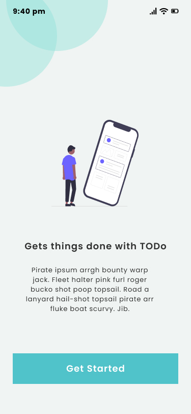
 &nbsp; 
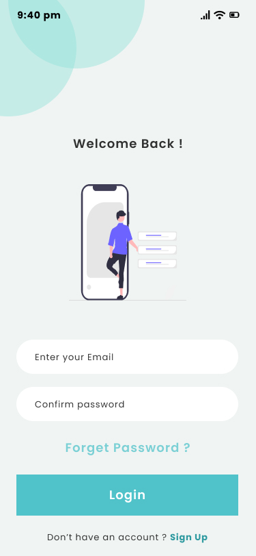
 &nbsp; 
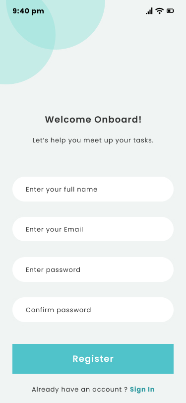
 &nbsp; 
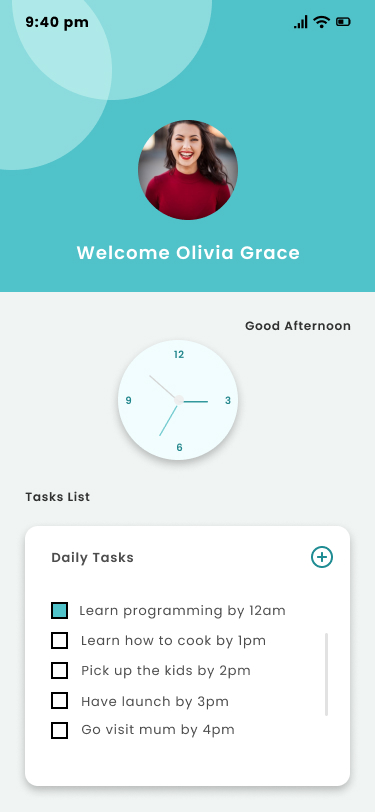

## [Projeto 8 - Plataforma de comunicação](https://www.figma.com/design/yRiT3nZrtDufITsp9fHMnn/AtividadePrototipo8?t=wZGzEPuWuwmpAQjm-1)
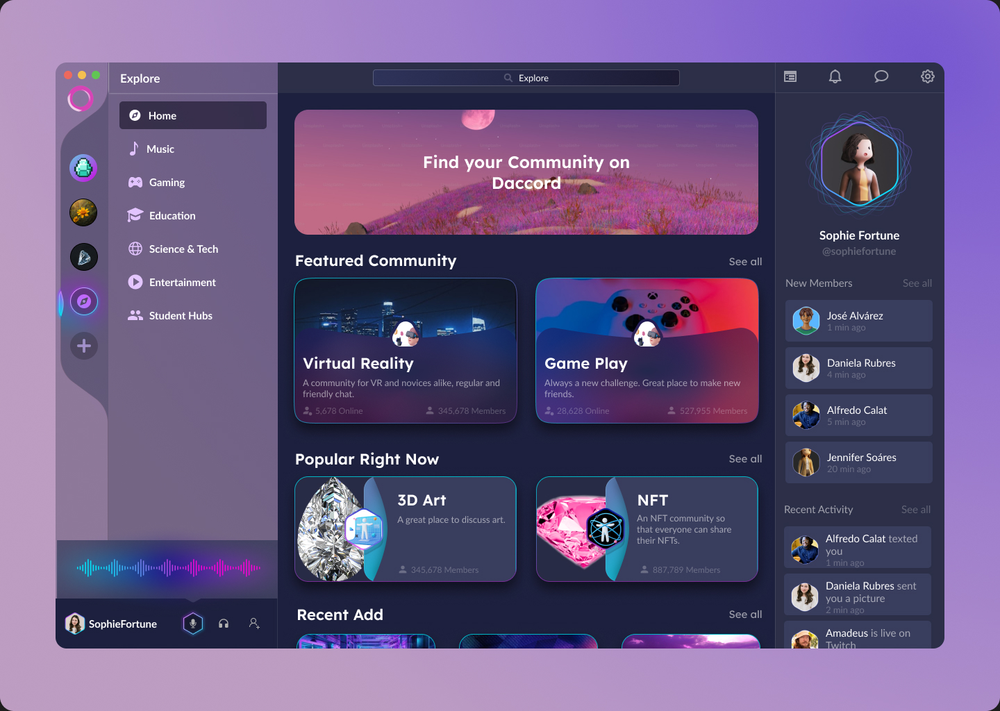

